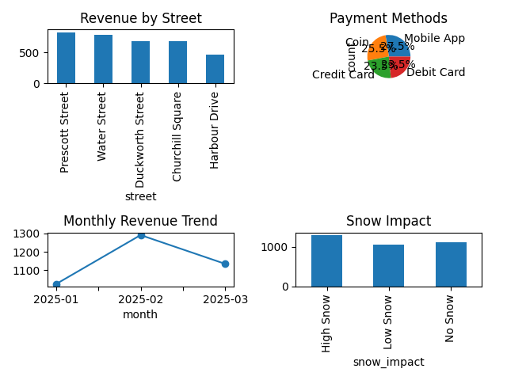

# St. John's Parking Analytics Pipeline

## Project Overview

This project is a local data analytics case study inspired by parking and mobility operations in St. John's, Newfoundland and Labrador.

The goal of the project is to analyze parking demand, revenue patterns, payment behaviour, and winter weather impact using CSV datasets, SQL analysis, and a Power BI dashboard.

This project was designed to demonstrate skills relevant to Data Analyst and Business Systems Analyst roles, including data analysis, SQL, ETL, data mapping, documentation, reporting, business requirements, and dashboard development.

## Business Problem

City parking teams need clear and reliable reporting to understand:

- Which parking areas generate the most revenue
- Which streets have the highest parking demand
- How winter weather affects parking usage
- Which payment methods are most commonly used
- Where operational improvements may be needed

Without structured reporting, decision makers may have difficulty identifying parking trends, revenue changes, and service improvement opportunities.

## Project Objectives

- Create realistic CSV datasets for parking sessions, parking zones, and weather data
- Clean and transform raw data using a simple ETL process
- Build SQL tables for structured analysis
- Write SQL queries to answer business questions
- Create a Power BI dashboard for business reporting
- Document business requirements, data mapping, and UAT test cases

## Tools Used

- CSV datasets
- SQL
- SQLite
- Python with pandas for optional ETL cleaning
- Power BI
- GitHub documentation

## Folder Structure

```text
st-johns-parking-analytics-pipeline/
│
├── data/
│   ├── raw/
│   │   ├── raw_parking_sessions.csv
│   │   ├── parking_zones.csv
│   │   └── weather_sample.csv
│   │
│   └── processed/
│       ├── clean_parking_analytics.csv
│       └── parking_summary_by_area.csv
│
├── sql/
│   ├── create_tables.sql
│   └── analysis_queries.sql
│
├── etl/
│   └── clean_transform_data.py
│
├── dashboard/
│   ├── dashboard_guide.md
│   └── powerbi_measures.txt
│   └── dashboard_screenshot.png    
│
├── docs/
│   ├── business_requirements.md
│   ├── data_mapping.md
│   ├── uat_test_cases.md
│   └── project_summary.md
│
└── README.md
```

## Dataset Description

This project uses synthetic CSV datasets created for portfolio and learning purposes. The data is inspired by common local parking operations in St. John's.

### Main Dataset

`raw_parking_sessions.csv`

Contains individual parking session records.

Main fields:

- session_id
- date
- street
- area
- hours_parked
- rate_per_hour
- payment_method
- vehicle_type
- revenue

### Supporting Datasets

`parking_zones.csv`

Contains parking area and zone details.

`weather_sample.csv`

Contains sample weather information to analyze winter impact.

## ETL Process

The ETL script performs the following steps:

1. Extracts raw CSV files
2. Cleans text fields
3. Fixes inconsistent formatting
4. Handles missing values
5. Calculates additional fields such as month, day of week, and weekend flag
6. Joins parking data with weather data
7. Creates processed CSV files for SQL and Power BI analysis

Run the ETL file:

```bash
python etl/clean_transform_data.py
```

## SQL Analysis

The SQL analysis answers these questions:

1. Which area generates the most parking revenue?
2. Which streets have the highest demand?
3. Which payment method is most used?
4. How does snow impact parking sessions?
5. Is demand higher on weekdays or weekends?
6. What is the monthly revenue trend?
7. Are high-priority areas generating expected revenue?

SQL files are stored in the `sql` folder.

## Power BI Dashboard

The Power BI dashboard should include:

- Total Revenue
- Total Parking Sessions
- Average Parking Duration
- Revenue by Street
- Payment Method Breakdown
- Monthly Revenue Trend
- Parking Sessions by Snow Impact
- Street Level Summary Table

Use this file in Power BI:

## Power BI Dataset

Use this file in Power BI Desktop:

data/processed/clean_parking_analytics.csv

## Dashboard Preview


```text
data/processed/clean_parking_analytics.csv
```

## Key Insights

Sample insights from this project:

- Downtown streets generate the highest parking revenue due to higher hourly rates and higher session volume.
- Mobile App is the most used payment method, showing strong adoption of digital payment options.
- Parking sessions decrease during high snow days, showing that winter weather affects demand.
- Weekday sessions are higher than weekend sessions, suggesting commuter and business activity influence parking demand.
- Water Street and Duckworth Street are among the busiest parking locations in the sample data.

## Business Systems Analyst Angle

This project also includes BSA style documentation:

- Business requirements
- Data mapping
- Functional requirements
- UAT test cases
- Process documentation

This shows the ability to understand both business needs and technical data solutions.

## Data Analyst Angle

This project demonstrates:

- SQL analysis
- Data cleaning
- ETL workflow
- Data modeling
- Dashboard development
- Business insight generation

## Disclaimer

This project uses synthetic data for portfolio purposes. It is not official City of St. John's parking data.
